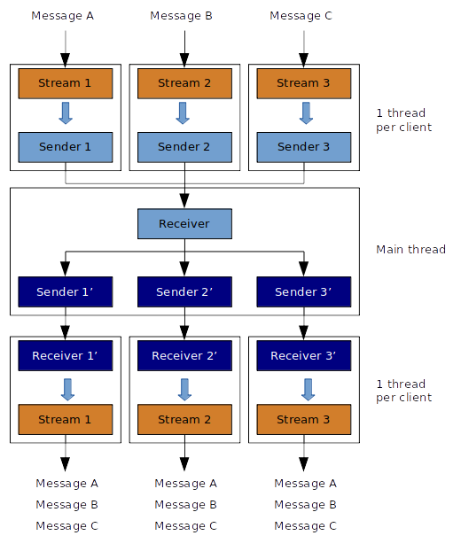

# Chat-Server built using Rust



NOTE: The code contains a lot of comments explaining how the server works.

## Installation

```bash
vagrant up
```

## Connection

```bash
vagrant ssh
```

## Execution

```bash
cargo run
```

## Generate documentation

```
cargo rustdoc -- --no-defaults
```

## Send messages from your host

```bash
nc localhost 9090
```
